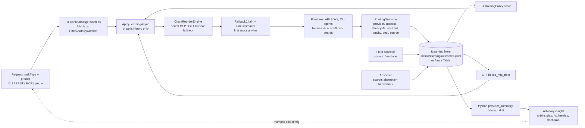

# AIHub Language Roles — C# at the Center, One System for Every Shell

*Every claim below cites the repo file that grounds it; update this page in the same PR
that changes those files.* Design companions:
[MULTI_LLM_INTEGRATION.md](MULTI_LLM_INTEGRATION.md) (provider matrix and layering),
[HERMES_FLEET_AND_XCORE.md](HERMES_FLEET_AND_XCORE.md) (fleet design),
[CLOUD_SHELL_AND_LOCAL_FLEET.md](CLOUD_SHELL_AND_LOCAL_FLEET.md) (bring-up),
[HYBRID_CLOUD_ARCHITECTURE.md](HYBRID_CLOUD_ARCHITECTURE.md) (trust boundaries),
[ABSORPTION_PIPELINE.md](ABSORPTION_PIPELINE.md) (the learning intake),
[LLM_STRENGTHS_PLAYBOOK.md](LLM_STRENGTHS_PLAYBOOK.md) (which model, when),
[ADR-0010-WINUI3-ONLY.md](ADR-0010-WINUI3-ONLY.md) (the desktop decision). The
operating skill is [.claude/skills/aihub-unity/SKILL.md](../../.claude/skills/aihub-unity/SKILL.md);
the report-only advisor is
[.claude/agents/aihub-strategist.md](../../.claude/agents/aihub-strategist.md).

New to the hub? Start with [GETTING_STARTED.md](../GETTING_STARTED.md) — the five-minute
path to a first `helios-ai ask`; this page is the system view behind it.

## One system, reached through four contracts

HELIOS runs **one** AI hub, not one per shell or one per model. `AIHubService`
(`src/ai/HELIOS.AIHub/AIHub.cs:18`) is the single facade; everything else is a door
into it or a spoke hanging off it:

| Who reaches the hub | Through which contract | Ground truth |
|---|---|---|
| Azure Cloud Shell, GitHub Codespaces, local `pwsh`/`bash` | the `helios-ai` CLI (`src/ai/HELIOS.AIHub.Cli/Program.cs:406-434` lists every command) | `CLOUD_SHELL_AND_LOCAL_FLEET.md` "Azure Cloud Shell — optimal use" |
| The WinUI 3 shell (`src/gui/HELIOS.Shell`) | REST only — `AIHubApiClient` calls `GET /v1/status` and never loads hub assemblies (`src/gui/HELIOS.Shell/Services/AIHubApiClient.cs:15-19`) | `src/ai/HELIOS.AIHub.Api/ApiEndpoints.cs:30-313` |
| Any MCP client (Claude Code, Codex CLI, Copilot, Cursor) | the stdio MCP server registered in `.mcp.json`; `helios_*` tools in `src/mcp/HELIOS.Mcp/*.cs` | `src/mcp/HELIOS.Mcp/Program.cs:10-13` |
| The Claude Code plugin | same MCP server, no second instance (`plugins/helios-operator/tests/validate_contract.py` enforces it) | `CLAUDE_CODE_OPERATOR_PLUGIN.md` |
| Every provider and model in `config/aihub.json` | `ProviderFactory.CreateAll` builds one `IChatProviderAgent` per `providers` entry and per `cliAgents` entry (`src/ai/HELIOS.AIHub/Providers/ProviderFactory.cs:21-39`) | `config/aihub.json:3-86` |
| Every agent lane — Claude Code, Codex CLI, Copilot, Hermes lanes, the four Xcore-9 pools | CLI agents are providers (`CliProcessAgent`, `ProviderFactory.cs:31-37`); fleet dispatch is the `agent_fleet_dispatch` task type (`config/aihub.json:198-200`); pools reach the hub through the same CLI/REST (`HERMES_FLEET_AND_XCORE.md` "Cross-pool coordination") | `config/fleet/fleet-topology.json:105-114` |
| The Azure access plane — OIDC federation, the ops workload identity, Key Vault | secrets resolve env-var → Key Vault → Unconfigured by **name** (`src/ai/HELIOS.AIHub/Configuration/SecretResolver.cs`); Azure auth terminates in Entra via `DefaultAzureCredential` (`ProviderFactory.cs:181-186`) | `HYBRID_CLOUD_ARCHITECTURE.md` "The two custody chains" |
| The local access plane — Ollama, the fleet stub, Docker | `ollama` is a provider with no key (`ProviderFactory.cs:191-198`); the stub worker honors the Hermes lane contract (`src/ai/python/helios_agents/fleet_worker.py:1-43`); `docker-compose.yml` ships `helios-ai-api` and the `fleet-stub` profile | `CLOUD_SHELL_AND_LOCAL_FLEET.md` "Docker" |

Learning data flows back into **one store** regardless of door: every routed or tandem
call appends a `RoutingOutcome` through `ILearningStore`
(`src/ai/HELIOS.AIHub/Learning/LearningStore.cs:8-127`), the fleet collector appends
`source: "fleet-lane"` records to the same JSONL (`helios_agents/fleet_learning.py:8-41`),
and the absorber posts `source: "absorption-benchmark"` records to `POST /v1/learning`
(`scripts/absorption/absorb-pr.ps1:287-299`). The API host, the MCP server, and ad-hoc
CLI calls all append to the same file under a cross-process lock
(`LearningStore.cs:152-163`).

## The center: what the hub owns

`AIHubService` owns all I/O, credentials, and cross-language coordination
(`.claude/skills/csharp-orchestrator/SKILL.md` "Hub-and-spoke rule"). Its public surface
is small and the same behind every door:

| Operation | C# entry | CLI | REST | MCP tool |
|---|---|---|---|---|
| Ask one provider (or the default chain) | `AskAsync` (`AIHub.cs:152`) | `helios-ai ask` | `POST /v1/ask` | `helios_ai_ask` |
| Route by task type with learned reorder + fallback | `RouteAsync` (`AIHub.cs:171`) | `helios-ai route` | `POST /v1/route` | `helios_ai_route` |
| Race the whole chain, report the learned winner | `TandemAsync` (`AIHub.cs:747`) | `helios-ai tandem` | `POST /v1/tandem` | `helios_ai_tandem` |
| Fan out to several providers, flag duplicates | `CompareAsync` (`AIHub.cs:712`) | `helios-ai compare` | `POST /v1/compare` | `helios_ai_compare` |
| Readiness without network calls | `GetStatus` (`AIHub.cs:785`) | `helios-ai status` | `GET /v1/status` | `helios_ai_status` |
| The routing table | `RoutingTable` (`AIHub.cs:74`) | `helios-ai routing` | `GET /v1/routing` | `helios_task_routing_get` |
| Catalog pick under a preference | `SelectOptimalProfile` (`AIHub.cs:138`) | `helios-ai ask --optimize … --for …` | — | `helios_optimal_provider_get` |
| Advisory fleet plan | `CreateFleetPlanner` (`AIHub.cs:85`) | `helios-ai fleet-plan` | — | `helios_fleet_plan_get` |
| Engine catalog / plan (Python spoke) | `PythonInsightsSpoke` | `helios-ai engines`, `engine-plan` | `GET /v1/engines`, `POST /v1/engines/recommend` | `helios_engine_catalog_get`, `helios_engine_mix_recommend` |
| Outcomes, insights, metrics | `Learning` (`AIHub.cs:77`) | — | `GET /v1/learning`, `/v1/insights`, `/v1/metrics` | — |

What the center can touch, and through which contract:

- **Providers** — `config/aihub.json` `providers` and `cliAgents`, bound by
  `AIHubOptions` (`src/ai/HELIOS.AIHub/Configuration/AIHubOptions.cs:10-22`). The file
  carries env-var and Key Vault secret *names* only (`AIHubOptions.cs:6-9`).
- **Outcomes** — `RoutingOutcome` records (`LearningStore.cs:8-74`): `outcomeId`,
  `timestamp`, `taskType`, `provider`, `model`, `success`, `latencyMs`, `costUsd`,
  `quality`, `pool`, `source`. No token counts are persisted
  (`src/ai/HELIOS.AIHub.Api/ApiModels.cs:113-117`).
- **Insights** — the Python spoke's `provider_summary` and `detect_drift` over
  chronological outcomes (`src/ai/HELIOS.AIHub/Learning/PythonInsightsSpoke.cs:58-65`).
- **Fleet** — the read-only topology view (`src/ai/HELIOS.AIHub/Fleet/FleetTopology.cs:41`)
  and the advisory planner (`src/ai/HELIOS.AIHub/Fleet/FleetPlanService.cs:53`).
- **Absorption** — watchlist plus benchmark reports as a read-only overlay
  (`helios-ai absorb-status`, `src/mcp/HELIOS.Mcp/HeliosStatusTools.cs:36`).
- **Azure / Foundry inventory** — read-only management-plane inventory and Foundry
  agent listing (`src/mcp/HELIOS.Mcp/HeliosAzureTools.cs:29`,
  `HeliosFoundryTools.cs:31`); the one explicit mutation is
  `helios_foundry_agent_create` (`HeliosFoundryTools.cs:75`).

The REST surface is loopback-only unless the caller sends `HELIOS_API_ACCESS_KEY` as
`X-HELIOS-Api-Key`, compared in fixed time (`ApiEndpoints.cs:324-348`); hosted use still
needs identity-aware ingress (`ApiEndpoints.cs:315-319`).

## The three spokes and the Python agents

Spokes are invoked *by* C# and never talk to each other
(`.claude/skills/csharp-orchestrator/SKILL.md:8-10`). Each row below names the exact
seam that exists today.

### C++ — the native spoke

| Aspect | Today |
|---|---|
| Role | Tight numeric loops over caller-owned buffers: cosine similarity, UTF-8 token estimation, the online-SGD MLP routing learner (`src/ai/HELIOS.AIHub.Native/helios_aihub_native.h:1-15`) |
| Seam | Flat C ABI with status codes (`helios_aihub_native.h:34-39`) consumed via source-generated `LibraryImport` with `CallConvCdecl` (`src/ai/HELIOS.AIHub/Native/NativeMethods.cs:12-71`); one ABI handshake per process (`NativeGate.cs:9-35`, `ExpectedAbiVersion = 2` at `NativeMethods.cs:17`) |
| Exemplars | `helios_mlp_train` — online SGD, sigmoid output, cross-entropy loss (`helios_aihub_native.cpp:310-384`); `helios_cosine_similarity` — double accumulation (`helios_aihub_native.cpp:120-145`); `helios_estimate_tokens` — two-regime UTF-8 estimate (`helios_aihub_native.cpp:174-210`) |
| What it reads from learning data | Nothing directly. C# hands it flat `float[]` feature rows the F# spoke built (`src/ai/HELIOS.AIHub/Learning/NeuralRoutingLearner.cs:76-102`) |
| How it hands results back | Sigmoid scores written into caller-owned `out_scores` (`helios_aihub_native.h:122-125`); the hub converts to `double` and the F# spoke fuses (`NeuralRoutingLearner.cs:100-102`) |
| Must never | Allocate across the boundary, throw, call managed code, open sockets, or read `config/aihub.json` (`helios_aihub_native.h:12-14`; `.claude/skills/cpp-performance/SKILL.md:107`) |
| Absent | Everything degrades: managed token heuristic, unmarked compare results, the F# linear policy (`AIHub.cs:436-477`, `AIHub.cs:516-518`, `NeuralRoutingLearner.cs:47-51`) |

CPU/memory layout, SIMD, and the D3D12/Win2D seams the shell will use are detailed in
`.claude/skills/cpp-performance/references/cpu-memory-graphics-abi.md`; graphics work
stays in the native spoke and is consumed by the shell through the hub's interop layer,
never by the shell loading spoke DLLs (`.claude/skills/winui3-shell/SKILL.md:6`).

### F# — the domain spoke

| Aspect | Today |
|---|---|
| Role | Pure functions over immutable records: cost, context budget, catalog selection, the linear routing score, feature engineering and score fusion for the MLP (`src/ai/HELIOS.AIHub.Domain/HELIOS.AIHub.Domain.fsproj:7`) |
| Seam | In-process assembly reference (`src/ai/HELIOS.AIHub/HELIOS.AIHub.csproj:26-29`); `*Interop` static members take only primitives and parallel arrays (`Pricing.fs:75-100`, `RoutingPolicy.fs:152-181`, `LearnerFusion.fs:237-308`, `ContextBudget.fs:70-119`, `ModelSelection.fs:104-196`) |
| Exemplars | `RoutingPolicy.score` (`RoutingPolicy.fs:87-97`) and `reorderChain` (`RoutingPolicy.fs:105-135`); `ContextBudget.filterFits` (`ContextBudget.fs:50-58`); `Pricing.costOf` with `usd/Mtoken` measures (`Pricing.fs:47-49`); `LearnerFusion.featuresOf`, `target`, `mlpWeight`, `fuseChain` (`LearnerFusion.fs:97-235`) |
| What it reads from learning data | Snapshots only — arrays of provider/success/latency/cost/quality the hub read from the store, newest-first flipped to chronological where prequential replay needs it (`NeuralRoutingLearner.cs:53-69`) |
| How it hands results back | A permutation of the configured chain (`RoutingPolicy.fs:99-104`), a filtered chain that is never empty (`ContextBudget.fs:46-49`), a `float` cost, or `""`/`[||]` for "no answer" (`ModelSelection.fs:108-109`) |
| Must never | Open sockets, read files, read the clock, or expose `FSharpOption`/`FSharpList`/tuples to C# (`Pricing.fs:13-14`, `.claude/skills/fsharp-functional/SKILL.md:105-116`) |

Async/task, query, numerics, and search idioms for this spoke:
`.claude/skills/fsharp-functional/references/async-query-math-search.md`.

### C# — the hub itself

| Aspect | Today |
|---|---|
| Role | APIs, DI, interactivity, ease of access: the facade, the REST host, the MCP server, the CLI, the WinUI 3 shell's view models |
| Seam | `Microsoft.Extensions.AI` `IChatClient` for OpenAI, GitHub Models, Azure OpenAI, and Ollama through one agent (`src/ai/HELIOS.AIHub/Providers/ChatClientAgent.cs:8-12`); native SDKs behind `ProviderAgentBase.ChatCoreAsync` (`ProviderAgentBase.cs:128`); `CliProcessAgent` argv templates with the prompt as one argv element, never a shell (`CliProcessAgent.cs:7-12`) |
| Exemplars | `FallbackChain.ExecuteAsync` parameterized by provider (`src/ai/HELIOS.AIHub/Resilience/FallbackChain.cs:55-106`); `CircuitBreaker` — 5 failures, 60 s open, one half-open probe (`CircuitBreaker.cs:28-37`); `CompareAsync` fan-out with `Task.WhenAll` (`AIHub.cs:720-727`); DI in the shell (`src/gui/HELIOS.Shell/App.xaml.cs:39-52`) and in the MCP host (`src/mcp/HELIOS.Mcp/Program.cs:27-45`) |
| What it reads from learning data | Everything, through `ILearningStore`: one task type per routing decision (`LearningStore.cs:89-91`), all task types for telemetry (`LearningStore.cs:119-126`) |
| How it hands results back | `ChatResult` (`src/ai/HELIOS.AIHub/Abstractions/ChatModels.cs:40-49`) on every door; provider failures are payload, not transport (`ApiEndpoints.cs:13-15`) |
| Must never | Throw for expected absence — a missing key is `ProviderReadiness.Unconfigured` with a hint (`ChatModels.cs:52-62`, `ProviderFactory.cs:12-15`); let learning break routing (`AIHub.cs:254-259`); store a secret value |

.NET 10 orchestration patterns: `.claude/skills/csharp-orchestrator/references/dotnet10-orchestration.md`.

### Python — agents, Linux tooling, libraries

| Aspect | Today |
|---|---|
| Role | Analytics over outcomes, text work, the truthful engine catalog, the fleet-lane collector and summary, and the dependency-free fleet worker stub (`src/ai/python/helios_agents/__init__.py:1-23`) |
| Seam | One JSON request on stdin, one JSON response on stdout, `python3 -m helios_agents` (`helios_agents/__main__.py:1-13`); C# side `PythonInsightsSpoke` with a static four-slot `SemaphoreSlim` and a 30 s timeout (`PythonInsightsSpoke.cs:16-17`); fleet ops as argv subcommands (`__main__.py:93-129`) |
| Exemplars | `analysis.provider_summary` / `detect_drift` (`analysis.py:54-127`, thresholds at `20-22`); `engines.recommend_engine_mix` keeping `selected_engines` and `candidate_engines` separate (`engines.py:434-569`); `fleet_learning.collect` with the idempotent sidecar index (`fleet_learning.py:164-233`); `fleet_worker` claim-lease protocol (`fleet_worker.py:72-89`) |
| What it reads from learning data | Outcome dicts the hub passes in, chronological (`analysis.py:1-8`); the JSONL file and the run directory for fleet ops (`fleet_learning.py:164-168`) |
| How it hands results back | `{"ok": true, "result": …}` on stdout; a non-`ok` envelope becomes `null` insight in C# (`PythonInsightsSpoke.cs:162-167`) |
| Must never | Call providers, other spokes, or the network; accept credentials; fan out with `asyncio`/`multiprocessing` inside an op (`__init__.py:3-5`; `.claude/skills/python-agents/references/parallelization-and-fleets.md` "asyncio / multiprocessing") |

Agent scripting, Linux tooling, and library policy:
`.claude/skills/python-agents/references/agents-linux-libraries.md`.

## Data flow: request to next routing

Sources for each edge: `AIHub.cs:171-252` (route), `AIHub.cs:341-390` (context filter),
`AIHub.cs:261-328` (learning reorder), `ChainReorderEngine.cs:81-99`,
`FallbackChain.cs:55-106`, `AIHub.cs:636-680` (record), `AIHub.cs:688-709` (cost),
`FleetPlanService.cs:74-133`, `fleet_learning.py:164-233`, `absorb-pr.ps1:287-299`.

### Who learns what from what

| Learner | Language | Input | Output | Consumed by | Advisory or live |
|---|---|---|---|---|---|
| `RoutingPolicy.reorderChain` | F# | Per-task-type organic outcomes (window `learning.historyWindow`, `config/aihub.json:224`) | Reordered chain; thin-evidence providers keep their slot (`RoutingPolicy.fs:51-52`) | `RouteAsync`, `TandemAsync` winner, `fleet-plan` | Live only when `learning.adaptiveRouting` is `true` (`config/aihub.json:223` is `false`; `aihub.cloud.json:72` is `true`) |
| `helios_mlp_train` + `LearnerFusion.fuseChain` | C++ + F# | Prequential feature rows from the same organic history (`LearnerFusion.fs:138-152`) | Per-provider success probability, blended at most 50 % with the linear score (`LearnerFusion.fs:192-194`) | Same as above, when ≥ 12 training samples and the native library is present (`NeuralRoutingLearner.cs:29-30,47-51`) | Same gate as above |
| `provider_summary`, `detect_drift` | Python | Chronological outcomes for one task type, advisory records included | Per-provider stats, drift list | `GET /v1/insights` | Advisory only |
| `/v1/metrics` aggregation | C# | Recent outcomes across all task types, advisory included (`ApiEndpoints.cs:153-157`) | Per-provider attempts, success rate, latency, recorded cost | Dashboards, the WinUI 3 metrics seam (`ApiModels.cs:92-100`) | Display only |
| `FleetPlanService` | C# over the same engines | Organic outcomes per pool task type | `{pool, taskType, configuredChain, learnedChain, sampleCount, engine}` | `helios-ai fleet-plan`, `helios_fleet_plan_get` | Advisory only — topology is config (`FleetPlanService.cs:49-52`) |
| `fleet_summary` | Python | `source: "fleet-lane"` records plus `scale-log.jsonl` | Per-pool block rate, mean latency, scale/burst counts | `learn-fleet.ps1` report | Advisory only |
| `ModelSelection.rank` | F# | The static catalog, not outcomes (`config/model-catalog.json`) | Best provider/model under a preference | `--optimize`, `helios_optimal_provider_get` | A prior, not learning (`ModelSelection.fs:10-13`) |

Every source-tagged record — `absorption-benchmark`, `fork-observation`, `fleet-lane` —
is dropped before any chain is reordered (`ChainReorderEngine.OrganicOnly`,
`ChainReorderEngine.cs:25-37`). External signals inform insights; they never steer
provider order.

## How fleets and the absorber attach to the same center

**Xcore-9 pools.** Four pools with their own boards, tool grants, provider chains, and
autoscaling blocks are config (`config/fleet/fleet-topology.json:28-104`). The hub sees
them two ways: as the `hermes` CLI agent behind `agent_fleet_dispatch`
(`config/aihub.json:81-85,198-200`), and as the advisory `fleet-plan` that scores each
pool's `providerChain` with exactly the engine `RouteAsync` uses
(`FleetPlanService.cs:40-48`). Pools never call each other; handoffs are tasks on another
pool's board (`fleet-topology.json:105-114`).

**Hermes lanes.** A lane is `hermes -p <assignee> chat -q <prompt>` with the four
`HERMES_KANBAN_*` variables, terminating via `kanban_complete` or `kanban_block`
(`fleet-topology.json:6-16`). Without the Hermes CLI, `start-fleet.ps1` falls back to the
Python stub that honors the same contract (`scripts/fleet/start-fleet.ps1:1-14`). Lane
outcomes reach the store as `provider: "pool:<name>", source: "fleet-lane"`
(`fleet_learning.py:145-161`); a lane running a routed hub call additionally stamps
`pool` from `HELIOS_FLEET_POOL` (`AIHub.cs:657`).

**VMSS burst.** Off unless both `deployFleetVmss` and a non-empty `vmssAdminPublicKey`
are set at deploy time; the reconciler makes at most one absolute `az vmss scale` call per
pass and prints an advisory notice when unwired (`scripts/fleet/scale-fleet.ps1:1-50`,
`CLOUD_SHELL_AND_LOCAL_FLEET.md` "Azure-VM burst runbook"). Burst lanes seed empty boards
today — capacity pre-provisioning, not throughput.

**The absorber / tester / merger program.** `absorb-pr.ps1` trial-merges an upstream PR
in a disposable worktree, runs the same gate CI runs, writes
`.helios/absorption/pr-<N>.json`, and posts one advisory outcome to `POST /v1/learning`
(`scripts/absorption/absorb-pr.ps1:1-23,287-299`). It refuses to run on a
credential-bearing host (exit 3) unless the human overrides
(`absorb-pr.ps1:40-110`); the keyless hosted lane is
`.github/workflows/absorption-benchmark.yml` (`contents: read`, opt-in at line 67).
Batches are seeded onto the `xcore-infra` board through the lock-aware enqueue
(`scripts/fleet/seed-absorption-tasks.ps1:1-20`). Nothing merges automatically
(`ABSORPTION_PIPELINE.md` "Boundaries"); "merger" means a human cherry-picking from the
staged worktree.

**The Cloud Shell as the unity surface.** `scripts/bootstrap/first-run.sh` (and its
`.ps1` twin) chains the existing bootstrap scripts, records
`.helios/bootstrap-state.json`, and ends with the numbered owner checklist
(`first-run.sh:1-60`). The one-sitting login is
`pwsh scripts/bootstrap/connect-devices.ps1` (bash twin `connect-devices.sh`): both
device codes — gh and az — on one screen, then the chain without another prompt: the
GitHub Models token export (dot-sourced), the GitHub App via
`connect-github-app.ps1 -DispatchGovernance`, the ops identity via
`connect-admin.ps1 -SkipGitHub`, `auto-login.ps1`, `auth-doctor.ps1 -Json`, and
`first-run.sh --verify-only` (`scripts/bootstrap/connect-devices.ps1:4-5,33-52`);
`bash scripts/bootstrap/first-run.sh --connect` runs those logins as step 0 with
`-SkipChain`, because `first-run.sh` is the chain (`first-run.sh:53,132-155`). Every
lane is verify-first (`scripts/bootstrap/connect-all.ps1` header is the per-lane
orchestrator it builds on); identity pinning is `connect-account.ps1`, which also
reports the `helios-ops-automation` workload identity bridge. Key Vault values land
only in process environment variables, by the names
`config/aihub.json` declares (`scripts/bootstrap/README.md`, `load-env-from-keyvault.sh`
row).

## Invariants and their sources

| Invariant | Source |
|---|---|
| Recommendations and learning are advisory; nothing auto-executes | `CLAUDE.md` "Multi-LLM hub"; `config/aihub.json:218` (`adaptiveRouting` opt-in); `FleetPlanService.cs:49-52`; `HeliosFleetPlanTools.cs:30-33`; `engines.py:434-449` |
| Fleets and agents cannot grant themselves cloud or production authority | `CLAUDE.md` "Binding architecture rules" (protected environments are the only deployment authority); `AGENTS.md` "Agent authority"; `HYBRID_CLOUD_ARCHITECTURE.md` Boundary 1 (burst VMSS gets secrets only when an operator grants its MI `Key Vault Secrets User`) |
| External signals never steer provider chains | `ChainReorderEngine.cs:25-37`; `ApiEndpoints.cs:77-83` (`source` required on `POST /v1/learning`) |
| Names, not values | `AIHubOptions.cs:6-9`; `CLAUDE.md` "No secrets in Git"; `HYBRID_CLOUD_ARCHITECTURE.md` "Secret custody chain" |
| Unconfigured is a state, not an error | `ProviderFactory.cs:12-15`; `PythonInsightsSpoke.cs:7-13`; `FleetTopology.cs:86-92` |
| Learning must never break routing | `AIHub.cs:254-259,305-327`; `NeuralRoutingLearner.cs:14-18` |
| Spokes never call each other | `helios_aihub_native.h:4-7`; `helios_agents/__init__.py:3-5`; `NeuralRoutingLearner.cs:10-12` (the only place C++ and F# meet is C#) |
| WinUI 3 is the only active desktop framework; WPF is the temporary HC-002 baseline | `ADR-0010-WINUI3-ONLY.md`; `src/gui/HELIOS.Shell/HELIOS.Shell.csproj:25` (`UseWinUI`) |
| The shell has no logic and never reaches providers | `GUI_THEME_ANALYSIS.md` "Recommendation"; `App.xaml.cs:43-45`; `AIHubApiClient.cs:15-19` |
| `/v1/*` is loopback-only without the access key; hosted use needs identity-aware ingress | `ApiEndpoints.cs:315-348` |

## The language dimension (PR #248)

Issue #242's items 1–5 landed in PR #248 as `docs/architecture/ROUTING_LANGUAGE_DIMENSION.md`
and the code it describes; item 9 of the same list, the per-language reviewer agents,
landed in the same PR. What is on this tree:

| Piece | Where |
|---|---|
| Lookup order `taskRouting["{taskType}:{language}"]` → `taskRouting[taskType]` → `defaultChain` | `TaskTypeRoutingStrategy.GetChain(taskType, language)` delegating to `ResolveChain`, which also returns the key the lookup stopped at, `Routing/TaskTypeRoutingStrategy.cs:168-196`; pinned by `tests/HELIOS.AIHub.Tests/Routing/TaskTypeRoutingStrategyTests.cs` |
| Language normalization (`C#` → `csharp`, `F#` → `fsharp`, `c++` → `cpp`, `ps1` → `powershell`; blank → no language) | `TaskTypeRoutingStrategy.NormalizeLanguage`, `Routing/TaskTypeRoutingStrategy.cs:67-80`; `SplitRoutingKey` (`:90-96`) for consumers of the whole table |
| Shipped qualified chains | `config/aihub.json:105-125,144-156` — `code_generation:cpp`, `code_generation:fsharp`, `code_generation:python`, `code_review:bicep`, `code_review:powershell`; mirrored with hosted providers in `config/aihub.cloud.json:47-54` |
| The language on a request | `ChatRequest.Language` and `HubRouteRequest.Language`, `Abstractions/ChatModels.cs:11-18,28-32`; REST `POST /v1/route` body field `language` (`ApiModels.cs:10-21`) |
| CLI | `helios-ai route <task-type> "<prompt>" --language L` (`Program.cs:79-107`); `helios-ai routing` marks qualified chains with `+` (`Program.cs:175-194`) |
| MCP | `helios_ai_route` optional `language` (`src/mcp/HELIOS.Mcp/HeliosAiTools.cs:32-48`) |
| Outcomes | `RoutingOutcome.Language`, omitted from JSON when null (`Learning/LearningStore.cs:27-37`); the spoke's `provider_summary` adds a `languages` map only when an outcome carries one (`analysis.py:80-105`) |
| Learning scope | `ChainReorderEngine.ForLanguage` (`Learning/ChainReorderEngine.cs:49-62`) — a language-qualified route learns from records tagged with that language, falling back to the parent's language-less records, never to another language's; `LearningKey` (`:65-66`) keeps the learner caches apart; pinned by `tests/HELIOS.AIHub.Tests/Learning/LanguageScopedHistoryTests.cs` |
| Reviewer agents | `.claude/agents/fsharp-reviewer.md`, `python-reviewer.md`, `powershell-reviewer.md`, rostered in `config/fleet/fleet-topology.json:42,58,74` |

Nothing above changes the advisory contract: `adaptiveRouting` stays `false` by default,
and a request with no language behaves exactly as it did before the dimension existed.
